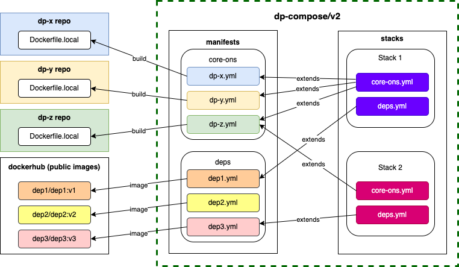

# v2

Motivation for v2 is to create a consistent structure that allows our teams to easily stand up a local development environment in a stable, reliable and repeatable way.

Eventually we plan to move this v2 directory up to root and remove/refactor all other directories/files to provide a single source of truth.

## Getting started

### Prerequisites

The scripts in this repo require a few tools to be installed before running them.

1. If you haven't already, then [install `brew`](https://brew.sh/):

   ```shell
   /bin/bash -c "$(curl -fsSL https://raw.githubusercontent.com/Homebrew/install/HEAD/install.sh)"
   ```

2. We provide a Brewfile to install the dependencies, but this can cause issues if you have manually installed any of the tools rather than using brew. Please review the [Brewfile](./Brewfile) to see what will be installed and comment out any items you have manually installed outside of brew before continuing.
3. Install the dependencies:

   ```shell
   brew bundle --no-lock --file=./Brewfile
   ```

4. (Optional) It might be a good idea to clean the Docker environment - purge all containers/volumes/images and start fresh. Any issues then definitely give this a go first.

:warning: We require all repos listed in the [manifests](manifests) to be cloned in the same parent directory as this repo (i.e. `../../`). If you have already cloned any of these repos to a different location it is recommended that you either delete or move them before continuing.

### Usage

Each stack is independent from the other, and `make` should be run from the root of the stack you want to use.

For example:

```shell
$ cd stacks/auth      # use the 'auth' stack (relative to this directory)
$ make check          # run some pre-flight checks
..some checks are run...
$ make clone          # clone the relevant repos
...git clone activity for the repos in this stack...
$ make init           # patch/prep the relevant repos
```

Please follow the instructions in [stacks README](./stacks/README.md) for more information on running each stack.

**Note: before starting a stack you should stop any other stack running.**

## Structure

The required configs and scripts have been structured as follows:



### dockerfiles

Contains `Dockerfile.dp-compose` files for services that do not have a `Dockerfile.local` yet. Each repository should have its own `Dockerfile.local`, so this `dockerfiles` folder can be removed when this is the case.

### manifests

Contains docker compose config `yml` files for each service that is required by any of the stacks. These configurations are stack agnostic and define all the necessary env vars to run the services in any possible configuration that might be required by any stack. Each env var has a sensible default value, which will be used if not provided by the stack, and usually corresponds to the default value in the service config.

The files are organised in subfolders according to their type:

- core-ons: Core services implemented by ONS
- deps: Dependencies, not implemented by ONS, used by ONS services

### stacks

Contains definitions for each stack, including config overrides and docker compose extension files. Each stack should be independent from the other stacks, but they should extend the required manifests, overwriting any env vars required by the stack to work as expected.

Each sub-folder corresponds to a particular stack and contains at least:

- `{stack}.yml`: Extended docker-compose file which uses the manifests for required services.
  - More information [here](https://docs.docker.com/compose/extends/)
- `default.env` and `local.env`: With the environmental variables required to override the default config for the services in the stack (`local.env` is git-ignored because it contains your local, and possibly sensitive, env vars)
  - More information [here](https://docs.docker.com/compose/environment-variables/#using-the---env-file--option)

#### stack env files

Note that each `*.env` file should be used only to override required env vars for that particular stack, and check that any compulsory env vars for the stack are set (for example, most stacks will require your system to have `SERVICE_AUTH_TOKEN` and `zebedee_root`).

For example, the following `default.env` file:

- checks for compulsory env vars
- defines relative paths to shared manifests and provisioning scripts
- overwrites default values used by the stack and/or extended manifests
- configures docker compose for the stack

```shell
# -- Compulsory env vars validation --
zebedee_root=${zebedee_root:?please define a valid zebedee_root in your local system}
SERVICE_AUTH_TOKEN=${SERVICE_AUTH_TOKEN:?please define a valid SERVICE_AUTH_TOKEN in your local system}

# -- Paths --
PATH_MANIFESTS="../../manifests"
PATH_PROVISIONING="../../provisioning"

# -- Stack config env vars that override manifest defaults --
IS_PUBLISHING="false"

# -- Docker compose vars --
COMPOSE_FILE=deps.yml:core-ons.yml
COMPOSE_PATH_SEPARATOR=:
COMPOSE_PROJECT_NAME=home-web
COMPOSE_HTTP_TIMEOUT=120
```

Any changes to these stack defaults - that only affect your individual circumstances - should go into the `local.env` file in the given stack.

### provisioning

Contains scripts and files to set the initial state required for stacks to work. This include things like database collections, content, etc.

## Kafka

Some stacks use KRaft mode, which is an [early release](https://github.com/apache/kafka/blob/6d1d68617ecd023b787f54aafc24a4232663428d/config/kraft/README.md).
