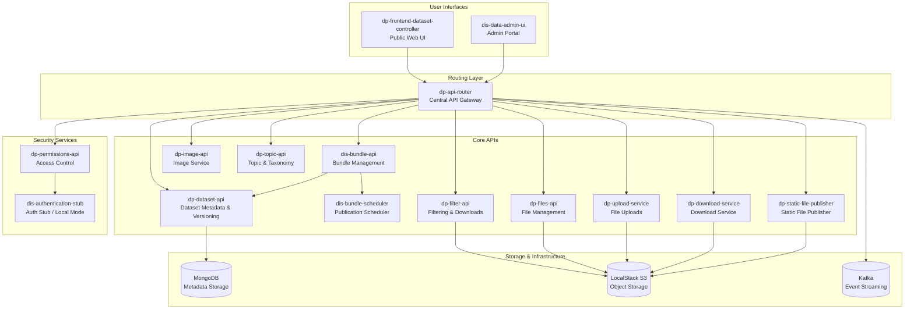

# Dataset Catalogue - Operational Runbook

## Service Overview

The **Dataset Catalogue** service provides an inventory and discovery interface for datasets across the ONS Digital Publishing ecosystem. It exposes both API and user interface layers that enable:

- **Public users** to browse available datasets, inspect metadata, and determine suitability for use.  
- **Internal publishers and administrators** to manage, curate, and release datasets through controlled publication workflows.  

The service integrates with downstream APIs to aggregate dataset metadata, bundle releases, and provide filtering and download capabilities. It is a key part of the **Dataset Publication pipeline**, bridging the data storage layer (`dp-dataset-api`) and presentation layer (`dis-dataset-admin-ui` and frontend controllers).

**Key Functions:**
- Dataset versioning and metadata storage
- Dataset filtering and custom download generation  
- Bundle creation and publication workflow
- File management and storage operations
- User permissions and access control
- Administrative web interfaces

## Architecture Diagram



## List of Dependencies with Stakeholders

### Internal Services
| Service                                                    | Function                                | Stakeholder              | Contact           |
| ---------------------------------------------------------- | --------------------------------------- | ------------------------ | ----------------- |
| [`../dp-dataset-api`](../../../dp-dataset-api)             | Dataset metadata storage and versioning | OFS Back-end Developers  | #dp-backend-dev   |
| [`../dp-filter-api`](../../../dp-filter-api)               | Dataset filtering and downloads         | OFS Back-end Developers  | #dp-backend-dev   |
| [`../dis-bundle-api`](../../../dis-bundle-api)             | Bundle publication workflow             | OFS Back-end Developers  | #dp-backend-dev   |
| [`../dis-bundle-scheduler`](../../../dis-bundle-scheduler) | Scheduled publication automation        | OFS Back-end Developers  | #dp-backend-dev   |
| [`../dp-permissions-api`](../../../dp-permissions-api)     | User/service permissions management     | OFS Back-end Developers  | #dp-backend-dev   |
| [`../dis-data-admin-ui`](../../../dis-data-admin-ui)       | Administrative web interface            | OFS Front-end developers | #dp-frontend-dev  |
| [`../dp-files-api`](../../../dp-files-api)                 | File storage operations                 | Team Open Source         | #team-open-source |
| [`../dp-api-router`](../../../dp-api-router)               | API request routing and load balancing  | Team Open Source         | #team-open-source |


### External Dependencies
| Service       | Function                                  | Stakeholder                | Contact             |
| ------------- | ----------------------------------------- | -------------------------- | ------------------- |
| MongoDB       | Database storage for metadata             | Infrastructure Team        | #infrastructure     |
| LocalStack S3 | File storage simulation                   | Development Infrastructure | #dev-infrastructure |
| Kafka         | Event streaming for service communication | Infrastructure Team        | #infrastructure     |

## Start/Stop/Restart Instructions

**For complete setup instructions, see:** [Dataset Catalogue README](README.md)

### Quick Start Commands for local builds

```bash
cd $ONS/dp-compose/v2/stacks/dataset-catalogue

# Prerequisites
colima start # Start Colima
make pull                    # Clone required repositories
make up-with-seed            # Start with test data (requires mongosh)

# Regular operations
make up                      # Start all services
make down                    # Stop all services  
make health                  # Check health of all services
make refresh                 # Restart all services
```

### Individual Service Control

```bash
# Service-specific operations
make up SERVICE=$SERVICE_NAME              # Start specific service
make down SERVICE=$SERVICE_NAME            # Stop specific service
make refresh SERVICE=$SERVICE_NAME              # Restart specific service
```

### Health Verification

```bash
# Quick health checks
curl http://localhost:22000/health      # Dataset API
curl http://localhost:26900/health      # Files API
curl http://localhost:29400/health      # Admin UI
curl http://localhost:29500/health      # Auth Stub
```
### Expected Health Response
```json
{
    "status": "OK",
    "version": {
        "build_time": "2025-11-04T13:56:07Z",
        "git_commit": "a2c0935ecc14c99dfefa1580b90ef2c339b5e7ad",
        "language": "go",
        "language_version": "go1.24.6",
        "version": ""
    },
    "uptime": 3319406,
    "start_time": "2025-11-04T13:59:13.516091015Z",
    "checks": []
}
```

## Escalation Contacts
### Team-Specific Contacts
| Component                                    | Team              | Contact           |
| -------------------------------------------- | ----------------- | ----------------- |
| **Core APIs** (dataset, filter, permissions) | OFS Backend Team  | `#dp-backend-dev` |
| **Infrastructure** (router, files, auth)     | Team Open Source  | `#dp-platform`    |
| **UI Components** (admin-ui, frontend)       | OFS Frontend Team | `#dp-frontend`    |
| **Bundle Management**                        | Publication Team  | `#dp-publishing`  |

### External Dependencies
| Service            | Team                    | Contact                    |
| ------------------ | ----------------------- | -------------------------- |
| **MongoDB**        | Infrastructure Team     | `#infrastructure`          |
| **LocalStack/S3**  | Dev Infrastructure      | `#dev-infrastructure`      |
| **Networking/DNS** | Platform Infrastructure | `#platform-infrastructure` |

## Known Limitations
### Current Environment Limitations
- **Development Mode**: Uses authentication stub instead of florence auth token
- **File Storage**: LocalStack S3 simulation has size and performance constraints

### Known Issues & Workarounds

<details>
<summary><strong>Failed to Publish Bundle (for SCHEDULED bundle)</strong></summary>

**Description**  
A bundle that was scheduled for publication failed to publish.  
This is a common issue, typically caused by missing or invalid content items in the bundle.

---

**How to Diagnose**

1. **Check Slack Alerts**  
   - Open the `#prod-alarm` Slack channel.  
   - Locate the alert message containing:  
     - Error message (e.g. `"bundle has no content items"`)  
     - Bundle title  
     - `bundle_id`  
     - Bundle type  
   - This provides enough context to begin investigating in **Kibana** for related logs.

2. **Inspect MongoDB Records**  
   Run the following queries against the **`dis-bundle`** MongoDB database:

   ```js
   // Retrieve the bundle record
   db.getCollection('bundles').find({ "id": "bundle-id" });

   // Retrieve content items for the bundle
   db.getCollection('bundle_contents').find({ "bundle_id": "bundle-id" });

   // Retrieve all events related to a bundle or its content items
   db.getCollection('bundle_events').find({ "resource": "/bundles/bundle-id/contents/content-item-id" });
   // or
   db.getCollection('bundle_events').find({ "resource": "/bundles/bundle-id" });
   ```

3. **Cross-Check Dataset Versions**  
   - Use details from the `dis-bundle` database to query the **`datasets`** database (specifically the `versions` collection).  
   - Confirm that the related dataset versions are approved and consistent.

---

**Possible Causes**

- One or more content items are still unapproved.  
- The bundle is not yet in an `approved` state.  
- An unexpected event disrupted the publication workflow.  

---

**Workaround**

- Verify that all content items are **approved**.  
- Ensure the bundle state correctly transitions from `approved` → `scheduled` → `publishing`.  
- Manually re-trigger the publish process after validation passes.  
- If the issue persists, escalate to the **OFS Back-end Developers** team.

---

</details>

---

<details>
<summary><strong>API Timeout</strong></summary>

**Description**  
Eg: dp-filter-api:
Users may experience timeouts or failed downloads when requesting filtered datasets.  
This typically indicates connectivity or resource issues between `dp-filter-api` and dependent services.

---

**How to Diagnose**

1. **Check Filter API Health Endpoint**
   ```bash
   curl http://localhost:22100/health
   ```
   - A healthy service should return **200 OK**.
   - If the service is unresponsive, continue to Step 2.

2. **Check Service Logs**
   - Inspect Docker logs for `dp-filter-api`:
     ```bash
     docker logs dp-filter-api
     ```
   - Look for connection errors or timeout traces involving:
     - `dp-dataset-api`
     - `dp-files-api`
     - `Kafka` events

3. **Check Dependencies**
   - Confirm that `dp-dataset-api` and `dp-files-api` are reachable:
     ```bash
     curl http://localhost:22000/health
     curl http://localhost:26900/health
     ```

---

**Possible Causes**

- `dp-dataset-api` or `dp-files-api` is down or unhealthy.  
- Network latency or timeout between services.  
- Large filter requests exceeding default time limits.  

---

**Workaround**

- Restart the `dp-filter-api` container:
  ```bash
  docker restart dp-filter-api
  ```
- Retry the dataset download.  
- If issues persist, verify dataset availability in `dp-dataset-api`.  
- Escalate to **OFS Back-end Developers** if the service remains unresponsive.

---

</details>