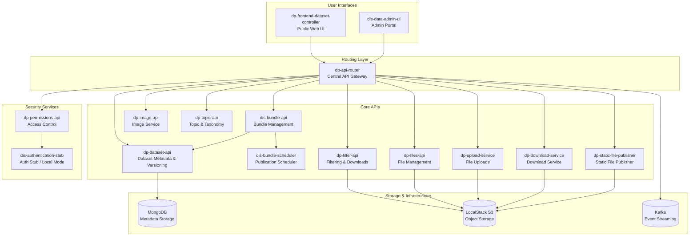
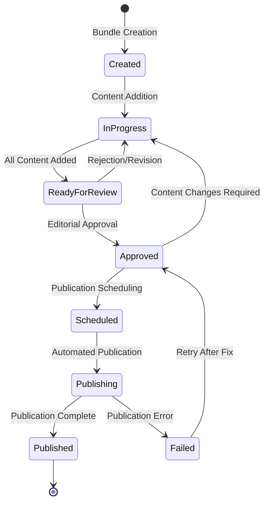

# Dataset Catalogue Service - Operational Runbook

**Labels:** `Dataset-Catalogue`, `Operations`, `Bundle-Publication`, `OFS`, `Service-Operations`  
**Audience:** Publishing Managers, OFS Back-end Developers, Support/Operations Engineers  
**Owner:** OFS Back-end Developers  
**Review Cycle:** Quarterly (Every 3 months)  
**Source:** DIS-2963, DIS-3764

---

## Table of Contents

- [Dataset Catalogue Service - Operational Runbook](#dataset-catalogue-service---operational-runbook)
  - [Table of Contents](#table-of-contents)
  - [Service Overview](#service-overview)
  - [Architecture Diagram](#architecture-diagram)
  - [List of Dependencies with Stakeholders](#list-of-dependencies-with-stakeholders)
    - [Internal Services](#internal-services)
    - [Platform Services](#platform-services)
    - [External Dependencies \& Integrations](#external-dependencies--integrations)
  - [Start/Stop/Restart Instructions](#startstoprestart-instructions)
    - [Quick Start Commands for local builds](#quick-start-commands-for-local-builds)
    - [Individual Service Control](#individual-service-control)
    - [Health Verification](#health-verification)
    - [Expected Health Response](#expected-health-response)
  - [Configuration Management](#configuration-management)
    - [Environment Variables](#environment-variables)
      - [Core Service Configuration](#core-service-configuration)
      - [Database \& Storage Configuration](#database--storage-configuration)
      - [Authentication \& Authorization](#authentication--authorization)
      - [External Service Integration](#external-service-integration)
    - [Secrets Management](#secrets-management)
  - [Core Service Operations](#core-service-operations)
    - [Bundle Publication Process](#bundle-publication-process)
      - [Publication Workflow States](#publication-workflow-states)
      - [Bundle Publication Steps](#bundle-publication-steps)
      - [Key Publication Operations](#key-publication-operations)
    - [Dataset Lifecycle Management](#dataset-lifecycle-management)
  - [API Endpoints \& Expected Responses](#api-endpoints--expected-responses)
    - [Core Dataset API Endpoints](#core-dataset-api-endpoints)
      - [Dataset Metadata Operations](#dataset-metadata-operations)
      - [Bundle Management Operations](#bundle-management-operations)
    - [File Management Operations](#file-management-operations)
    - [Health \& Status Endpoints](#health--status-endpoints)
    - [Error Response Format](#error-response-format)
  - [Health Monitoring \& Alerts](#health-monitoring--alerts)
    - [Health Monitoring Dashboard](#health-monitoring-dashboard)
  - [Common Failures \& Fixes](#common-failures--fixes)
    - [Bundle Publication Failures](#bundle-publication-failures)
      - [Failed to Publish Bundle (Scheduled Bundle)](#failed-to-publish-bundle-scheduled-bundle)
      - [Dataset API Timeout Issues](#dataset-api-timeout-issues)
      - [File Upload/Download Failures](#file-uploaddownload-failures)
  - [Audit Logging \& Troubleshooting](#audit-logging--troubleshooting)
    - [Audit Trail Locations](#audit-trail-locations)
      - [Application Logs](#application-logs)
      - [Database Audit Logs](#database-audit-logs)
      - [System Integration Logs](#system-integration-logs)
    - [Troubleshooting Workflows](#troubleshooting-workflows)
      - [Bundle Publication Investigation](#bundle-publication-investigation)
      - [Performance Investigation](#performance-investigation)
  - [Escalation Contacts](#escalation-contacts)
    - [Escalation Matrix by Severity](#escalation-matrix-by-severity)
    - [Team-Specific Contacts \& Responsibilities](#team-specific-contacts--responsibilities)
      - [Primary Service Ownership](#primary-service-ownership)
      - [Platform \& Infrastructure](#platform--infrastructure)
      - [External Service Integrations](#external-service-integrations)
      - [Infrastructure Dependencies](#infrastructure-dependencies)
    - [Emergency Response Procedures](#emergency-response-procedures)
      - [P1 Critical Incident Response](#p1-critical-incident-response)
      - [Cross-Service Issue Resolution](#cross-service-issue-resolution)
  - [Known Limitations](#known-limitations)
    - [Service Architecture Limitations](#service-architecture-limitations)
    - [Data \& Storage Constraints](#data--storage-constraints)
    - [Integration \& External Dependencies](#integration--external-dependencies)
    - [Development \& Testing Constraints](#development--testing-constraints)
    - [Security \& Compliance Limitations](#security--compliance-limitations)

---

## Service Overview

The **Dataset Catalogue** service is the core operational hub for dataset publication and discovery within the ONS Digital Publishing ecosystem. It orchestrates the complete dataset lifecycle from initial creation through public availability.

**Primary Responsibilities:**
- **Bundle Publication Process**: Manages the end-to-end workflow for dataset bundle creation, approval, scheduling, and publication
- **Dataset Metadata Management**: Maintains versioned dataset metadata and relationships
- **Public Discovery Interface**: Provides search, filtering, and download capabilities for published datasets
- **Administrative Control**: Enables content managers to oversee publication workflows and data governance
- **Cross-Service Integration**: Coordinates with external services (Wagtail CMS, Tracker system) for complete publication pipeline

**Business Impact:**
- Critical path service for all ONS dataset publications
- Directly affects public data availability and discovery
- Supports regulatory compliance and data governance requirements
- Enables internal publishing team productivity and workflow management

**Service Classification:**
- **Availability Requirement:** 99.9% uptime during business hours (09:00-17:00 GMT)
- **Recovery Time Objective (RTO):** 4 hours maximum downtime
- **Recovery Point Objective (RPO):** 1 hour maximum data loss acceptable

## Architecture Diagram



## List of Dependencies with Stakeholders

### Internal Services
| Service                                                    | Function                                | Stakeholder              | Contact           |
| ---------------------------------------------------------- | --------------------------------------- | ------------------------ | ----------------- |
| [`../dp-dataset-api`](../../../dp-dataset-api)             | Dataset metadata storage and versioning | OFS Back-end Developers  | #dp-backend-dev   |
| [`../dp-filter-api`](../../../dp-filter-api)               | Dataset filtering and downloads         | OFS Back-end Developers  | #dp-backend-dev   |
| [`../dis-bundle-api`](../../../dis-bundle-api)             | Bundle publication workflow             | OFS Back-end Developers  | #dp-backend-dev   |
| [`../dis-bundle-scheduler`](../../../dis-bundle-scheduler) | Scheduled publication automation        | OFS Back-end Developers  | #dp-backend-dev   |
| [`../dp-permissions-api`](../../../dp-permissions-api)     | User/service permissions management     | OFS Back-end Developers  | #dp-backend-dev   |
| [`../dis-data-admin-ui`](../../../dis-data-admin-ui)       | Administrative web interface            | OFS Front-end developers | #dp-frontend-dev  |
| [`../dp-files-api`](../../../dp-files-api)                 | File storage operations                 | Team Open Source         | #team-open-source |
| [`../dp-api-router`](../../../dp-api-router)               | API request routing and load balancing  | Team Open Source         | #team-open-source |


### Platform Services
| Service                                      | Function                               | Stakeholder      | Contact             |
| -------------------------------------------- | -------------------------------------- | ---------------- | ------------------- |
| [`../dp-api-router`](../../../dp-api-router) | API request routing and load balancing | Team Open Source | `#team-open-source` |
| [`../dp-files-api`](../../../dp-files-api)   | File storage operations                | Team Open Source | `#team-open-source` |

### External Dependencies & Integrations
| Service           | Function                                   | Stakeholder                | Contact               | SLA/Contact Details                  |
| ----------------- | ------------------------------------------ | -------------------------- | --------------------- | ------------------------------------ |
| **Wagtail CMS**   | Content publishing platform integration    | Wagtail Product Team       | `#wagtail-support`    | 4-hour response, escalate via JIRA   |
| **Tracker**       | Dataset tracking and analytics integration | DataOps Team               | `#dataops-platform`   | 2-hour response, PagerDuty available |
| **MongoDB**       | Database storage for metadata              | Infrastructure Team        | `#infrastructure`     | 24/7 support via Atlas, 1-hour SLA   |
| **LocalStack S3** | File storage simulation (dev only)         | Development Infrastructure | `#dev-infrastructure` | Best effort support                  |
| **Kafka**         | Event streaming for service communication  | Infrastructure Team        | `#infrastructure`     | 24/7 monitoring, 2-hour response     |
| **AWS S3**        | Production file storage                    | Cloud Platform Team        | `#cloud-ops`          | AWS Enterprise Support, 1-hour SLA   |

## Start/Stop/Restart Instructions

**For complete setup instructions, see:** [Dataset Catalogue README](README.md)

### Quick Start Commands for local builds

```bash
cd $ONS/dp-compose/v2/stacks/dataset-catalogue

# Prerequisites
colima start # Start Colima
make pull                    # Clone required repositories
make up-with-seed            # Start with test data (requires mongosh)

# Regular operations
make up                      # Start all services
make down                    # Stop all services  
make health                  # Check health of all services
make refresh                 # Restart all services
```

### Individual Service Control

```bash
# Service-specific operations
make up SERVICE=$SERVICE_NAME              # Start specific service
make down SERVICE=$SERVICE_NAME            # Stop specific service
make refresh SERVICE=$SERVICE_NAME              # Restart specific service
```

### Health Verification

```bash
# Quick health checks
curl http://localhost:22000/health      # Dataset API
curl http://localhost:26900/health      # Files API
curl http://localhost:29400/health      # Admin UI
curl http://localhost:29500/health      # Auth Stub
```

### Expected Health Response
```json
{
    "status": "OK",
    "version": {
        "build_time": "2025-11-04T13:56:07Z",
        "git_commit": "a2c0935ecc14c99dfefa1580b90ef2c339b5e7ad",
        "language": "go",
        "language_version": "go1.24.6",
        "version": ""
    },
    "uptime": 3319406,
    "start_time": "2025-11-04T13:59:13.516091015Z",
    "checks": []
}
```

---

## Configuration Management

### Environment Variables

#### Core Service Configuration
| Variable                       | Service      | Description                      | Example Value | Required |
| ------------------------------ | ------------ | -------------------------------- | ------------- | -------- |
| `BIND_ADDR`                    | All Services | Service binding address and port | `:22000`      | ✅        |
| `GRACEFUL_SHUTDOWN_TIMEOUT`    | All Services | Graceful shutdown timeout        | `5s`          | ✅        |
| `HEALTHCHECK_INTERVAL`         | All Services | Health check polling interval    | `30s`         | ✅        |
| `HEALTHCHECK_CRITICAL_TIMEOUT` | All Services | Critical health check timeout    | `90s`         | ✅        |

#### Database & Storage Configuration  
| Variable                 | Service                         | Description                        | Example Value               | Required |
| ------------------------ | ------------------------------- | ---------------------------------- | --------------------------- | -------- |
| `MONGODB_URI`            | dp-dataset-api, dis-bundle-api  | MongoDB connection string          | `mongodb://localhost:27017` | ✅        |
| `MONGODB_USERNAME`       | Database Services               | Database username                  | `dp-dataset-api`            | ✅        |
| `MONGODB_PASSWORD`       | Database Services               | Database password                  | `***`                       | ✅        |
| `AWS_REGION`             | File Services                   | AWS region for S3 operations       | `eu-west-1`                 | ✅        |
| `S3_BUCKET_NAME`         | dp-files-api, dp-upload-service | Primary S3 bucket for file storage | `ons-dp-prod-public`        | ✅        |
| `S3_PRIVATE_BUCKET_NAME` | dp-files-api                    | Private S3 bucket                  | `ons-dp-prod-private`       | ✅        |

#### Authentication & Authorization
| Variable                   | Service       | Description                        | Example Value                     | Required |
| -------------------------- | ------------- | ---------------------------------- | --------------------------------- | -------- |
| `SERVICE_AUTH_TOKEN`       | All Services  | Inter-service authentication token | `***`                             | ✅        |
| `ZEBEDEE_URL`              | All Services  | Authentication service endpoint    | `http://zebedee:8082`             | ✅        |
| `ENABLE_PRIVATE_ENDPOINTS` | API Services  | Enable/disable private endpoints   | `true`                            | ✅        |
| `PERMISSIONS_API_URL`      | dp-api-router | Permissions service endpoint       | `http://dp-permissions-api:25400` | ✅        |

#### External Service Integration
| Variable          | Service              | Description                  | Example Value                 | Required |
| ----------------- | -------------------- | ---------------------------- | ----------------------------- | -------- |
| `DATASET_API_URL` | dis-bundle-api       | Dataset API endpoint         | `http://dp-dataset-api:22000` | ✅        |

### Secrets Management

**Development Environment:**
- Uses placeholder/stub values for external integrations
- Authentication tokens are development-specific and rotated regularly

**Staging/Production Environment:**
- Secrets managed via dp-configs repository
- Audit logging for all secret access and modifications

**Critical Secrets:**
- `MONGODB_PASSWORD`: Database access credentials
- `SERVICE_AUTH_TOKEN`: Inter-service authentication
- `AWS_ACCESS_KEY_ID` / `AWS_SECRET_ACCESS_KEY`: S3 access credentials
- `WAGTAIL_API_KEY`: External CMS integration token
- `TRACKER_API_KEY`: Analytics platform integration token

---

## Core Service Operations

### Bundle Publication Process

The bundle publication process is the most critical operation managed by the Dataset Catalogue service. This workflow coordinates multiple services and external systems to ensure datasets are properly validated, approved, and published.

#### Publication Workflow States



#### Bundle Publication Steps

1. **Bundle Creation** (`POST /bundles`)
   - Creates new bundle record in `dis-bundle-api`
   - Generates unique bundle ID and initial metadata
   - Sets initial state to `Created`

2. **Content Assembly** (`POST /bundles/{id}/contents`)
   - Adds dataset versions to bundle
   - Validates dataset version states (must be `approved`)
   - Updates bundle state to `InProgress`

3. **Editorial Review** (Manual Process)
   - Content reviewers validate bundle contents via `dis-data-admin-ui`
   - Quality assurance checks performed
   - Bundle state updated to `ReadyForReview`

4. **Approval Process** (`PUT /bundles/{id}/approve`)
   - Senior editorial staff approve bundle for publication
   - Final validation of all content items
   - Bundle state updated to `Approved`

5. **Publication Scheduling** (`PUT /bundles/{id}/schedule`)
   - Bundle scheduled for automated publication
   - `dis-bundle-scheduler` service picks up scheduled bundles
   - Bundle state updated to `Scheduled`

6. **Automated Publication** (Background Process)
   - `dis-bundle-scheduler` triggers publication process
   - Coordinates with external services (Wagtail, Tracker)
   - Files published to public S3 buckets
   - Search indexes updated
   - Bundle state updated to `Publishing` → `Published`

#### Key Publication Operations

**Monitor Bundle Publication Status:**
```bash
# Check bundle status
curl -H "Authorization: Bearer $SERVICE_AUTH_TOKEN" \
     http://localhost:BUNDLE_API_PORT/bundles/{bundle-id}

# List all scheduled bundles
curl -H "Authorization: Bearer $SERVICE_AUTH_TOKEN" \
     http://localhost:BUNDLE_API_PORT/bundles?state=scheduled

# Check publication queue
curl -H "Authorization: Bearer $SERVICE_AUTH_TOKEN" \
     http://localhost:SCHEDULER_PORT/publish-queue
```

**Manual Bundle Operations:**
```bash
# Manually trigger bundle publication (emergency use only)
curl -X POST -H "Authorization: Bearer $SERVICE_AUTH_TOKEN" \
     http://localhost:SCHEDULER_PORT/bundles/{bundle-id}/publish

# Retry failed publication
curl -X PUT -H "Authorization: Bearer $SERVICE_AUTH_TOKEN" \
     http://localhost:BUNDLE_API_PORT/bundles/{bundle-id}/retry

# Cancel scheduled publication
curl -X DELETE -H "Authorization: Bearer $SERVICE_AUTH_TOKEN" \
     http://localhost:BUNDLE_API_PORT/bundles/{bundle-id}/schedule
```

### Dataset Lifecycle Management

**Dataset Version States:**
- `created` → `submitted` → `approved` → `published` → `archived`

**Key Dataset Operations:**
```bash
# Check dataset health and version status
curl http://localhost:22000/datasets/{dataset-id}/editions/{edition}/versions/{version}

# List all dataset versions requiring attention
curl http://localhost:22000/datasets?state=submitted

# Approve dataset version (requires permissions)
curl -X PUT -H "Authorization: Bearer $SERVICE_AUTH_TOKEN" \
     http://localhost:22000/datasets/{id}/editions/{edition}/versions/{version}/approve
```

---

## API Endpoints & Expected Responses

### Core Dataset API Endpoints

#### Dataset Metadata Operations
```bash
# Get dataset information
GET /datasets/{id}
# Response: 200 OK with dataset metadata JSON

# List dataset editions  
GET /datasets/{id}/editions
# Response: 200 OK with editions array

# Get specific dataset version
GET /datasets/{id}/editions/{edition}/versions/{version}
# Response: 200 OK with version details
```

#### Bundle Management Operations
```bash
# Create new bundle
POST /bundles
Content-Type: application/json
{
  "title": "Monthly GDP Release - November 2025",
  "description": "Economic indicators for Q3 2025",
  "type": "scheduled"
}
# Response: 201 Created with bundle ID

# Add content to bundle
POST /bundles/{bundle-id}/contents
Content-Type: application/json
{
  "dataset_id": "gdp-monthly",
  "edition": "time-series", 
  "version": "1"
}
# Response: 201 Created

# Schedule bundle for publication
PUT /bundles/{bundle-id}/schedule
Content-Type: application/json
{
  "publication_date": "2025-11-15T09:00:00Z",
  "notification_channels": ["email", "webhook"]
}
# Response: 200 OK
```

### File Management Operations
```bash
# Upload file to dataset version
POST /files/upload
Content-Type: multipart/form-data
# Response: 201 Created with file metadata

# Download published file
GET /files/downloads/{dataset-id}/{filename}
# Response: 200 OK with file content or 302 redirect to S3

# Check file processing status
GET /files/{file-id}/status
# Response: 200 OK with processing state
```

### Health & Status Endpoints
```bash
# Service health check
GET /health
# Response: 200 OK with service status

# Detailed health with dependencies
GET /healthcheck  
# Response: 200 OK with component health details

# Service metrics (Prometheus format)
GET /metrics
# Response: 200 OK with metrics in Prometheus format
```

### Error Response Format
All services return consistent error format:
```json
{
  "error": {
    "code": "VALIDATION_ERROR",
    "message": "Bundle cannot be published: missing required content items",
    "details": {
      "bundle_id": "abc123",
      "missing_items": ["dataset-version-456"],
      "timestamp": "2025-11-05T14:30:00Z"
    }
  }
}
```

---

## Health Monitoring & Alerts

### Health Monitoring Dashboard

**Service Health URLs:**
- Dataset API: `http://localhost:22000/health`
- Bundle API: `http://localhost:BUNDLE_PORT/health`  
- Files API: `http://localhost:26900/health`
- Admin UI: `http://localhost:29400/health`
- Permissions API: `http://localhost:25400/health`

**Health Check Response Indicators:**
- **Healthy**: HTTP 200, `"status": "OK"`, all dependency checks pass
- **Warning**: HTTP 200, `"status": "WARNING"`, some non-critical dependencies degraded  
- **Critical**: HTTP 503, `"status": "CRITICAL"`, service unable to operate

**Monitoring Metrics:**
- **Availability**: Service uptime percentage (target: 99.9%)
- **Performance**: API response times (target: p95 < 500ms)
- **Bundle Publication**: Success rate (target: 99.5%)
- **Error Rates**: HTTP 5xx responses (target: < 0.1%)
- **Queue Depth**: Pending bundle publications (alert if > 10)

**Alert Thresholds:**
- **Warning**: Response time > 1000ms, error rate > 1%
- **High**: Service down > 5 minutes, error rate > 5%
- **Critical**: Bundle publication failures > 3 consecutive, data corruption detected

---

## Common Failures & Fixes

### Bundle Publication Failures

#### Failed to Publish Bundle (Scheduled Bundle)
**Reference:** [DIS-3764](https://officefornationalstatistics.atlassian.net/browse/DIS-3764)

**Symptoms:**
- Bundle stuck in `scheduled` state beyond publication time
- Slack alert: `"Bundle publication failed: bundle has no content items"`
- Bundle scheduler logs show validation errors
- Public datasets not appearing on website after scheduled time

**Diagnostic Steps:**

1. **Check Bundle Status and Content**
   ```bash
   # Get bundle details
   curl -H "Authorization: Bearer $SERVICE_AUTH_TOKEN" \
        http://localhost:BUNDLE_PORT/bundles/{bundle-id}
   
   # List bundle contents
   curl -H "Authorization: Bearer $SERVICE_AUTH_TOKEN" \
        http://localhost:BUNDLE_PORT/bundles/{bundle-id}/contents
   ```

2. **MongoDB Investigation**
   ```js
   // Connect to dis-bundle database
   use dis_bundle;
   
   // Check bundle record
   db.bundles.find({"id": "bundle-id"});
   
   // Check content items
   db.bundle_contents.find({"bundle_id": "bundle-id"});
   
   // Check publication events
   db.bundle_events.find({
     "resource": {$regex: "bundles/bundle-id"}
   }).sort({"timestamp": -1});
   ```

3. **Cross-Check Dataset Versions**
   ```js
   // Connect to datasets database  
   use datasets;
   
   // Verify dataset version states
   db.versions.find({
     "dataset_id": "dataset-id",
     "edition": "edition-name", 
     "version": "version-number"
   });
   ```

**Root Causes & Fixes:**

| Cause                        | Symptoms                                                 | Resolution                                                       |
| ---------------------------- | -------------------------------------------------------- | ---------------------------------------------------------------- |
| **Unapproved Content Items** | Bundle contains dataset versions not in `approved` state | Approve required dataset versions via admin UI or API            |
| **Missing Content Items**    | Bundle has no associated content records                 | Re-add content items to bundle via `POST /bundles/{id}/contents` |
| **Bundle State Corruption**  | Bundle state inconsistent between services               | Reset bundle to `approved` state and reschedule                  |
| **External Service Failure** | Wagtail/Tracker integration timeout                      | Retry publication after external service recovery                |
| **Database Lock**            | Bundle record locked by concurrent operation             | Restart bundle services to clear locks                           |

**Recovery Procedure:**
```bash
# 1. Reset bundle to approved state
curl -X PUT -H "Authorization: Bearer $SERVICE_AUTH_TOKEN" \
     http://localhost:BUNDLE_PORT/bundles/{bundle-id}/reset-to-approved

# 2. Verify all content items are approved
curl http://localhost:22000/datasets/{dataset-id}/editions/{edition}/versions/{version}

# 3. Reschedule bundle publication
curl -X PUT -H "Authorization: Bearer $SERVICE_AUTH_TOKEN" \
     http://localhost:BUNDLE_PORT/bundles/{bundle-id}/schedule \
     -d '{"publication_date": "2025-11-05T15:00:00Z"}'

# 4. Monitor publication progress
curl http://localhost:SCHEDULER_PORT/bundles/{bundle-id}/status
```

#### Dataset API Timeout Issues

**Symptoms:**
- HTTP 504 Gateway Timeout from dp-dataset-api
- Bundle publication process hangs during dataset validation
- Admin UI showing "Loading..." indefinitely

**Diagnostic Steps:**
```bash
# Check API response times
curl -w "@curl-format.txt" -o /dev/null -s http://localhost:22000/health

# Check database connections
curl http://localhost:22000/healthcheck | jq '.checks[] | select(.name=="MongoDB")'

# Review service logs for timeout patterns
docker logs dp-dataset-api 2>&1 | grep -i timeout | tail -20
```

**Resolution:**
```bash
# Restart API service
docker restart dp-dataset-api

# Scale database connections if needed (production)
# Update MONGODB_MAX_POOL_SIZE environment variable

# Clear database connection pool
curl -X POST -H "Authorization: Bearer $SERVICE_AUTH_TOKEN" \
     http://localhost:22000/admin/database/reset-connections
```

#### File Upload/Download Failures

**Symptoms:**
- HTTP 500 errors during file upload
- Files not appearing in S3 bucket
- Download links returning 404 or access denied

**Diagnostic Steps:**
```bash
# Check S3 connectivity
aws s3 ls s3://your-bucket-name --profile your-profile

# Test file service health
curl http://localhost:26900/health

# Check file processing queue
curl -H "Authorization: Bearer $SERVICE_AUTH_TOKEN" \
     http://localhost:26900/files/queue/status
```

**Resolution:**
```bash
# Restart file services
docker restart dp-files-api dp-upload-service dp-download-service

# Clear stuck file processing jobs
curl -X DELETE -H "Authorization: Bearer $SERVICE_AUTH_TOKEN" \
     http://localhost:26900/files/queue/clear-failed

# Verify S3 permissions and bucket policies
aws s3api get-bucket-policy --bucket your-bucket-name
```

---

## Audit Logging & Troubleshooting

### Audit Trail Locations

#### Application Logs
```bash
# Service-specific logs
docker logs dp-dataset-api
docker logs dis-bundle-api  
docker logs dis-bundle-scheduler
docker logs dp-files-api

# Structured log queries
docker logs dp-dataset-api 2>&1 | jq 'select(.level=="ERROR")'
docker logs dis-bundle-api 2>&1 | grep -E "bundle.*publication"
```

#### Database Audit Logs
```js
// MongoDB audit collection queries
use dis_bundle;

// Bundle publication audit trail
db.bundle_events.find({
  "bundle_id": "target-bundle-id",
  "event_type": {$in: ["scheduled", "publishing", "published", "failed"]}
}).sort({"timestamp": 1});

// User action audit trail  
db.user_actions.find({
  "resource_type": "bundle",
  "resource_id": "target-bundle-id",
  "action": {$in: ["approve", "schedule", "publish"]}
});

// Dataset modification tracking
use datasets;
db.version_history.find({
  "dataset_id": "target-dataset",
  "modified_date": {$gte: ISODate("2025-11-01")}
});
```

#### System Integration Logs
```bash
# External service integration logs
grep -r "wagtail\|tracker" /var/log/ons-dp/ | tail -50

# API gateway logs (if using AWS API Gateway)
aws logs filter-log-events \
    --log-group-name /aws/apigateway/dataset-catalogue \
    --start-time $(date -d '1 hour ago' +%s)000
```

### Troubleshooting Workflows

#### Bundle Publication Investigation
1. **Identify Problem Bundle**
   - Gather bundle ID from alert or user report
   - Note expected vs actual publication time

2. **Check Bundle State Progression**
   ```bash
   # Get bundle timeline
   curl http://localhost:BUNDLE_PORT/bundles/{bundle-id}/timeline
   
   # Check current state and last modified
   curl http://localhost:BUNDLE_PORT/bundles/{bundle-id} | jq '.state,.last_modified'
   ```

3. **Validate Content Items**
   ```bash
   # List all content items and their states
   curl http://localhost:BUNDLE_PORT/bundles/{bundle-id}/contents | \
   jq '.items[] | {dataset_id, state, last_validated}'
   ```

4. **Review External Integration Status**
   ```bash
   # Check Wagtail CMS integration
   curl http://localhost:CMS_INTEGRATION_PORT/wagtail/status/{bundle-id}
   
   # Check Tracker system status  
   curl http://localhost:TRACKER_PORT/datasets/{dataset-id}/tracking-status
   ```

#### Performance Investigation
1. **Identify Slow Endpoints**
   ```bash
   # API response time analysis
   curl -w "Response time: %{time_total}s\n" http://localhost:22000/datasets
   
   # Database query performance
   # Connect to MongoDB and check slow query log
   ```

2. **Resource Utilization Check**
   ```bash
   # Container resource usage
   docker stats --no-stream
   
   # Memory and CPU analysis
   docker exec dp-dataset-api ps aux
   ```

3. **Network Connectivity Validation**
   ```bash
   # Inter-service connectivity
   docker exec dp-api-router curl http://dp-dataset-api:22000/health
   
   # External service connectivity
   curl -I https://wagtail.ons.gov.uk/api/health
   ```

---

## Escalation Contacts
### Escalation Matrix by Severity

| Severity            | Response Time    | Contact Method               | Escalation Path                          |
| ------------------- | ---------------- | ---------------------------- | ---------------------------------------- |
| **P1 - Critical** | 15 minutes       | PagerDuty → On-call Engineer | → Senior Developer → Head of Engineering |
| **P2 - High**     | 1 hour           | Slack `#dp-platform-alerts`  | → Team Lead → Product Owner              |
| **P3 - Medium**   | 4 hours          | Slack `#dp-backend-dev`      | → Sprint Team → Backlog                  |
| **P4 - Low**      | Next working day | JIRA ticket                  | → Product Backlog                        |

**P1 Critical Scenarios:**
- Complete service outage affecting dataset publication
- Data corruption or loss incidents  
- Security breaches or unauthorized access
- Bundle publication system down during peak publishing window (09:00-12:00 GMT)

**P2 High Scenarios:**  
- Single service degradation affecting user experience
- Bundle publication delays > 2 hours beyond schedule
- External integration failures (Wagtail, Tracker) lasting > 1 hour
- Performance degradation affecting publishing team productivity

### Team-Specific Contacts & Responsibilities

#### Primary Service Ownership
| Component                | Team             | Primary Contact   | Secondary Contact    | Expertise Area                                   |
| ------------------------ | ---------------- | ----------------- | -------------------- | ------------------------------------------------ |
| **dp-dataset-api**       | OFS Backend Team | `#dp-backend-dev` | `@backend-team-lead` | Dataset metadata, versioning, MongoDB operations |
| **dis-bundle-api**       | OFS Backend Team | `#dp-backend-dev` | `@backend-team-lead` | Bundle lifecycle, publication workflow           |
| **dis-bundle-scheduler** | OFS Backend Team | `#dp-backend-dev` | `@backend-team-lead` | Automated publication, scheduling logic          |
| **dp-filter-api**        | OFS Backend Team | `#dp-backend-dev` | `@backend-team-lead` | Dataset filtering        |
| **dp-permissions-api**   | OFS Backend Team | `#dp-backend-dev` | `@backend-team-lead` | Access control, user management                  |

#### Platform & Infrastructure
| Component             | Team              | Primary Contact     | Secondary Contact | Expertise Area                          |
| --------------------- | ----------------- | ------------------- | ----------------- | --------------------------------------- |
| **dp-api-router**     | Team Open Source  | `#team-open-source` | `@platform-lead`  | API routing, load balancing, networking |
| **dp-files-api**      | Team Open Source  | `#team-open-source` | `@platform-lead`  | File operations, S3 integration         |
| **dis-data-admin-ui** | OFS Frontend Team | `#dp-frontend`      | `@frontend-lead`  | UI components, user experience          |

#### External Service Integrations
| Service                   | Owner Team           | Contact             | SLA             | Escalation Process           |
| ------------------------- | -------------------- | ------------------- | --------------- | ---------------------------- |
| **Wagtail CMS**           | Wagtail Product Team | `#wagtail-support`  | 4-hour response | Slack → JIRA → Product Owner |
| **Tracker System**        | DataOps Team         | `#dataops-platform` | 2-hour response | Slack → PagerDuty (if P1/P2) |

#### Infrastructure Dependencies  
| Service                   | Owner Team              | Contact           | SLA                    | Support Details                   |
| ------------------------- | ----------------------- | ----------------- | ---------------------- | --------------------------------- |
| **MongoDB**         | Infrastructure Team     | `#infrastructure` | 24/7, 1-hour SLA       | Atlas Support + Internal DBA team |
| **AWS S3**                | Cloud Platform Team     | `#cloud-ops`      | AWS Enterprise Support | 24/7 via AWS Support Console      |
| **Kafka/Event Streaming** | Infrastructure Team     | `#infrastructure` | 24/7, 2-hour SLA       | Confluent Support + Internal team |
| **Kubernetes Platform**   | Container Platform Team | `#k8s-platform`   | 24/7, 1-hour SLA       | Platform Engineering team         |

### Emergency Response Procedures

#### P1 Critical Incident Response
1. **Immediate Actions (0-15 minutes)**
   - Acknowledge PagerDuty alert
   - Join incident response channel: `#incident-dataset-catalogue`
   - Assess impact scope and affected users
   - Communicate initial status via status page

2. **Investigation Phase (15-60 minutes)**
   - Gather diagnostic information using runbook procedures
   - Identify root cause or implement temporary workaround
   - Engage additional teams as needed based on investigation
   - Provide hourly updates to stakeholders

3. **Resolution & Recovery (1-4 hours)**
   - Implement permanent fix or detailed workaround
   - Validate service restoration and performance  
   - Communicate resolution to affected users
   - Schedule post-incident review within 48 hours

#### Cross-Service Issue Resolution
When issues involve multiple teams or external services:

1. **Coordination**: OFS Backend Team acts as primary coordinator
2. **Communication**: Maintain shared incident channel with all involved teams
3. **Decision Authority**: Senior Developer or Head of Engineering for service changes
4. **External Escalation**: Product Owner engages with external service providers
5. **Post-Resolution**: Joint post-mortem with all involved teams

## Known Limitations

### Service Architecture Limitations
- ** Single Point of Failure**: Bundle publication workflow has no built-in redundancy - scheduler service failure stops all publications
- ** Sequential Processing**: Bundle publications processed one-at-a-time, limiting throughput during peak publishing periods
- ** Tight Coupling**: Strong dependencies between services mean single service failure can cascade across the entire publication pipeline
- ** Limited Observability**: Insufficient distributed tracing makes cross-service issue diagnosis challenging

### Data & Storage Constraints  
- ** File Size Limits**: Maximum file upload size constrained by API gateway timeouts (currently ~500MB)
- ** Database Scaling**: MongoDB single-replica development setup cannot handle production-level concurrent operations
- ** Backup Recovery**: Point-in-time recovery limited to daily snapshots in development environment
- ** Storage Growth**: No automated archival policy for old dataset versions may lead to storage exhaustion

### Integration & External Dependencies
- ** Wagtail Integration**: CMS integration failures can block bundle publication without manual intervention capability  
- ** Tracker Dependency**: Analytics platform outages prevent dataset publication completion
- ** Authentication Limitations**: Development authentication stub cannot simulate production security scenarios
- ** Timeout Management**: Fixed timeout values may be insufficient for large dataset processing operations

### Development & Testing Constraints
- ** Test Data**: Limited representative test data makes production issue reproduction difficult
- **Environment Parity**: Configuration differences between dev/staging/production environments cause deployment issues
- ** Debug Access**: Production debugging requires elevated access approval, slowing incident resolution

### Security & Compliance Limitations  
- ** Access Control**: Granular permission system cannot enforce department-level data access restrictions
- ** Audit Trail**: Limited audit logging makes compliance reporting and forensic investigation difficult
- ** Data Encryption**: Files not encrypted at rest in development environment (LocalStack limitation)
- ** API Security**: Rate limiting not implemented, service vulnerable to abuse/DoS scenarios
